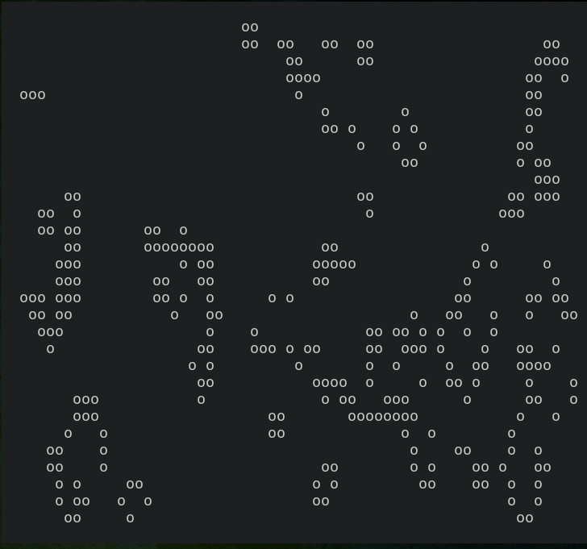

|logo|

*Conway's Game of Life Terminal Eye Candy implemented in Python.*

|website| |release| |rtd| |license| |travis-ci| |codecov|

PConway
=======

**features**

* Play Conway's Game of Life on your terminal.

**Documentation**: https://pconway.readthedocs.io

**Repository**: https://github.com/terrencetec/pconway

.. contents::
   :depth: 2

Getting Started
===============

Dependencies
------------

Required
^^^^^^^^
* Numpy
* Curses (Included in the Linux version of Python. For Windows users,
  install windows-curse)

Installation
------------
From source
^^^^^^^^^^^
.. code:: bash

   git clone https://github.com/terrencetec/pconway.git
   cd pconway
   pip install .

Debian based
^^^^^^^^^^^^
(Not available yet)

.. code:: bash

   sudo apt-get install pconway

Arch-based
^^^^^^^^^^
(Not available yet)
Install from AUR:

.. code:: bash

   paru -Syu pconway

or

.. code:: bash

   yay -Syu pconway

Usage
=====
.. code:: bash

   $ gameoflife

|screenshot default|

Help message
------------
.. code:: bash

  $ gameoflife -h
  usage: gameoflife [-h]
                    [-c {black,blue,cyan,green,magenta,red,white,yellow}]
                    [-C CHAR] [-b] [-s SPEED] [-m MUTATION_RATE]

  Play Conway's game of life

  optional arguments:
    -h, --help            show this help message and exit
    -c {black,blue,cyan,green,magenta,red,white,yellow}, --color {black,blue,cyan,green,magenta,red,white,yellow}
                          Foreground color. Defaults 'white'
    -C CHAR, --char CHAR  Character representing live cells.
                          Defaults 'o'.
    -b, --border          Border on the screen
    -s SPEED, --speed SPEED
                          Frame per second
    -m MUTATION_RATE, --mutation-rate MUTATION_RATE
                          Mutation rate

How to Contribute
=================

Try out the package and file an issue if you find any!

.. |website| image:: https://img.shields.io/badge/website-pconway-blue.svg
    :alt: Website
    :target: https://github.com/terrencetec/pconway

.. |release| image:: https://img.shields.io/github/v/release/terrencetec/pconway?include_prereleases
   :alt: Release
   :target: https://github.com/terrencetec/pconway/releases

.. |rtd| image:: https://readthedocs.org/projects/pconway/badge/?version=latest
   :alt: Read the Docs
   :target: https://pconway.readthedocs.io/

.. |license| image:: https://img.shields.io/github/license/terrencetec/pconway
    :alt: License
    :target: https://github.com/terrencetec/pconway/blob/master/LICENSE

.. |travis-ci| image:: https://travis-ci.com/terrencetec/pconway.svg?branch=master
    :alt: travis-ci
    :target: https://travis-ci.com/terrencetec/pconway

.. |codecov| image:: https://codecov.io/gh/terrencetec/pconway/branch/master/graph/badge.svg?token=NMEBAYFE2N
    :alt: codecov
    :target: https://codecov.io/gh/terrencetec/pconway

