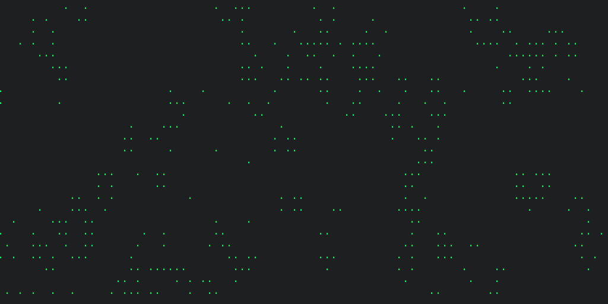

Usage
=====
Command
-------
.. code:: bash

   $ gameoflife -c green -m 0.01

|screenshot default|

Help message
------------
.. code:: bash

  $ gameoflife -h
  usage: gameoflife [-h]
                    [-c {black,blue,cyan,green,magenta,red,white,yellow}]
                    [-C CHAR] [-b] [-s SPEED] [-m MUTATION_RATE]

  Play Conway\'s game of life

  optional arguments:
    -h, --help            show this help message and exit
    -c {black,blue,cyan,green,magenta,red,white,yellow}, --color {black,blue,cyan,green,magenta,red,white,yellow}
                          Foreground color. Defaults \'white\'
    -C CHAR, --char CHAR  Character representing live cells.
                          Defaults '.'.
    -b, --border          Border on the screen
    -s SPEED, --speed SPEED
                          Frame per second
    -m MUTATION_RATE, --mutation-rate MUTATION_RATE
                          Mutation rate

